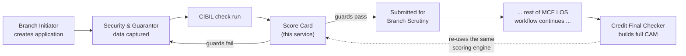
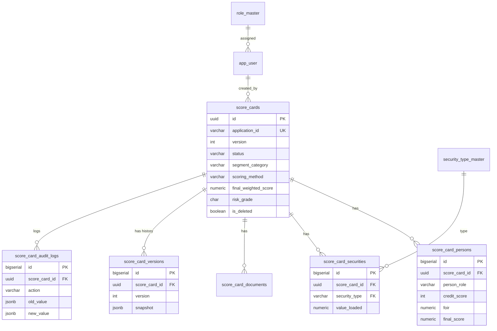
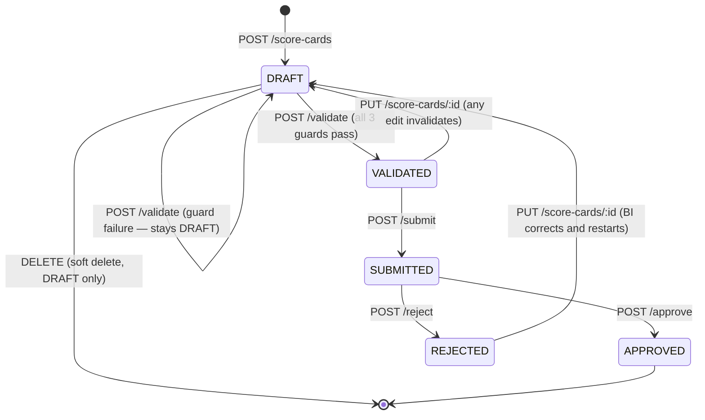

# MCF LOS — Score Card Module: Technical Documentation

## 1. Executive Summary

This service implements the **Score Card module** of the MCF Prize-Money-Against-Security
Loan Origination System: the subscriber/guarantor credit-risk scoring step that runs
before a loan application is submitted for scrutiny, and again — more formally — when
the Credit Final Checker builds the Credit Appraisal Memo (CAM). It is a standalone REST
API + PostgreSQL backend, independently deployable from the rest of MCF LOS.

The business logic implemented here is **not invented for this service** — it is
sourced from two authoritative documents, each covering a different part of the
module:

1. **Risk-Assessment Scoring Engine ("Annexure 2")** — the person-level Positive/
   Negative scoring, segmentation, FOIR bands, and A–D grade bands (Section 5.1–5.4,
   5.6). Already implemented client-side in the MCF LOS prototype
   (`assets/js/cam-engine.js`); this service is a faithful, unit-tested port of it.
2. **MuthootPappachan_LoanProcessing_FRD_v11** (Functional Requirements Document,
   Version 2.0) — the Score Card completeness/validation gate (Section 10, "Key
   System Validations & Business Rules"; Section 5.5 here), the Case Status
   Workflow (Section 11), and — corrected in this build — the per-security-type
   **Accepted Value Formula** (Section 6.1, Table 20; see Section 5.7 here). Note
   that in this FRD, "Scorecard" refers to a **document/data-completeness gate**,
   not a numeric points-based scoring system — there is no such point-matrix in
   the FRD; any UI mockup showing one (e.g. a static "CIBIL Score Factor +15 pts"
   widget) predates this FRD and was never wired to real computation.

Every formula, band, and guard condition in this codebase traces back to one of
these two sources. Where a business rule was not explicit in either, it is called
out under [Section 22 — Assumptions](#22-assumptions--open-questions), not silently
guessed.

**What this service does:**
- Accepts subscriber, guarantor, and security data for a loan application.
- Computes a Positive/Negative/Final risk score per person, a chit-value-and-security
  driven segment (Secured/Unsecured × value bucket), and a final weighted score.
- Maps the final score to a risk grade (A–D) and a default decision.
- Enforces the three guard conditions that gate submission (documents complete,
  security covers future liability, CIBIL complete for every person).
- Runs the full Draft → Validate → Submit → Approve/Reject lifecycle with a complete,
  immutable audit trail and version history.

**What this service deliberately does not do:** originate the loan application itself,
manage chit/auction data, handle disbursement, or replace the full 10-section CAM
(sections A–J) — those remain the responsibility of the main MCF LOS application; this
service is the Score Card sub-module within it, callable standalone via its own API.

---

## 2. Functional Overview

### 2.1 Where the Score Card sits in the loan journey



### 2.2 Mandatory vs. optional fields

| Field | M/O | Notes |
|---|---|---|
| `applicationId` | Mandatory | Must match `MCF-YYYY-NNNNNN`; one score card per application |
| `chitValue` | Mandatory | Drives segment bucket and the asset-net-worth test |
| `futureLiability` | Mandatory | Drives the `securityCoversLiability` guard |
| `documentsComplete` | Mandatory (boolean, defaults false) | Drives one of the three submit guards |
| `subscriber` | Mandatory | Full `Person` object — see Section 5 |
| `guarantors` | Optional (0–4) | Absent guarantors mean the final score is the SB score alone |
| `securities` | Mandatory (min. 1) | Drives `securityTotalValue` and secured/unsecured segmentation |
| `subscriber.foir` | Mandatory | Required for every scoring method (simple/moderate/comprehensive) |
| `subscriber.creditScore` | Optional at create, **mandatory before Validate can pass** | See `cibilComplete` guard |
| `entityType` | Conditional | Required only when `employmentType = "Business"`, forbidden otherwise |
| Comprehensive-KYC-only fields (`employeeCount`, `propertyCount`, `propertyValue`, `customerVintageYears`, `personalVisits`) | Optional | Only affect scoring under the `comprehensive` method; ignored under `simple`/`moderate` |

### 2.3 Section dependencies

- **Segmentation depends on Securities** — you cannot know the scoring method until
  the security list (and hence secured/unsecured classification) is known, so
  `securities` is required at creation, not deferred to a later step.
- **Scoring depends on Segmentation** — the same `Person` data scores differently
  under `simple` vs. `moderate` vs. `comprehensive`, because segmentation determines
  which formula runs (see Section 6).
- **Submit depends on Validate** — `POST /submit` will reject with
  `INVALID_STATE_FOR_SUBMIT` unless the card is already `VALIDATED`; validation is not
  an implicit side-effect of submit, by design, so a UI can show the client exactly
  which guard failed before they attempt to submit.
- **Approve/Reject depend on Submit** — only a `SUBMITTED` (or `UNDER_REVIEW`) card can
  be approved or rejected.

---

## 3. Architecture

```
scorecardapi/
├── db/
│   ├── schema.sql          # full DDL — tables, constraints, indexes, triggers
│   └── seed.sql            # master data + demo users (mirrors live MCF LOS config)
├── src/
│   ├── app.js               # Express app assembly (security middleware, routes, /docs)
│   ├── server.js            # process entrypoint, graceful shutdown
│   ├── config/               # env.js, db.js (pg Pool + withTransaction helper)
│   ├── middleware/            # auth (JWT), rbac, validate (Joi), sanitize, errorHandler
│   ├── modules/
│   │   ├── auth/                # login/refresh
│   │   ├── scorecard/            # the module itself: routes/controller/service/repository
│   │   │   └── scoring.engine.js  # <- the pure calculation engine (zero DB/HTTP deps)
│   │   └── masters/              # dropdown reference data
│   └── utils/                    # ApiError, apiResponse envelope, pagination
├── tests/                          # 155 automated tests (see Section 14)
├── openapi.yaml                     # full OpenAPI 3.0 spec, served at GET /docs
└── DOCUMENTATION.md                  # this file
```

**Layering (routes → controller → service → repository → DB):** the `scoring.engine.js`
module is intentionally the only place the actual Annexure 2 math lives, with zero
dependency on Express or `pg` — it is unit-testable in complete isolation (see the 81
tests in `tests/scoring.engine.test.js`), and could be lifted into a batch/offline
recompute job unchanged.

---

## 4. Database Design

### 4.1 Entity-Relationship Diagram



Full DDL: [`db/schema.sql`](db/schema.sql). Highlights:
- **Soft delete** on `score_cards` and `score_card_documents` (`is_deleted`,
  `deleted_at`, `deleted_by`) — nothing is ever hard-deleted through the API.
- **Versioning**: `score_card_versions` stores an immutable JSONB snapshot on every
  create/update/validate/submit/approve/reject/recalculate; `score_cards.version` is
  the pointer to the latest.
- **Exactly one current card per application**: enforced by
  `uq_score_cards_current_application`, a partial unique index on
  `(application_id) WHERE is_deleted = FALSE`.
- **Audit fields**: `created_by/at`, `updated_by/at`, `validated_by/at`,
  `submitted_by/at`, `reviewed_by/at`, `approved_by/at`, `rejected_by/at` are all
  first-class columns, not inferred from the audit log.

---

## 5. Business Rules

### 5.1 Segmentation (Annexure 2, Sections 2–3)

| Security backing | Chit value | Segment | Scoring method |
|---|---|---|---|
| Any of Gold/LIC/BG/FD/Chit Passbook/Sub-Debt/Demat NCD/Demat Shares | ≤ ₹10L | Secured ≤10L | **Simple** |
| (same list) | > ₹10L | Secured >10L | **Moderate** |
| Only Mortgage and/or Personal Surety (no tangible collateral) | ≤ ₹8L | Unsecured ≤8L | **Comprehensive** |
| (same) | ₹8L–₹25L | Unsecured 8L-25L | **Comprehensive** |
| (same) | > ₹25L | Unsecured >25L | **Comprehensive** |

> Mortgage and Personal Surety are excluded from the "Secured" list deliberately —
> Annexure 2 treats them as carrying no bankable collateral value for scoring purposes,
> even though a security row exists for them.

### 5.2 Scoring formula by method

- **Simple** (Secured ≤10L): flat **100** — security value already had to equal or
  exceed the Future Liability before the case could reach this stage, so no further
  positive scoring is needed.
- **Moderate** (Secured >10L): **70** (flat) + **FOIR band, max 30**.
- **Comprehensive** (all Unsecured buckets): **Profile Strength (max 20)** +
  **Vintage/Visit (max 5)** + **Income Stability (max 5)** + **FOIR (max 40)** +
  **Asset & Net Worth (max 30)** = **100 max**.

FOIR bands (percentage of income committed to obligations):

| FOIR | Moderate (max 30) | Comprehensive (max 40) |
|---|---|---|
| < 30% | 30 | 40 |
| 30–44% | 20 | 30 |
| 45–59% | 15 | 20 |
| 60–74% | 10 | 15 |
| 75–94% | 5 | 10 |
| ≥ 95% | 0 | 0 |

Comprehensive-method sub-scores:
- **Profile Strength (max 20)**: Govt/PSU = 20 flat. Salaried-Private scales by
  employer size (>100 staff + ≥3yrs tenure = 16; ≥20 staff = 12; else 8; unknown
  employer size defaults to 12). Business/Self-Employed scales by entity type
  (PvtLtd ≥5yrs = 20, else 17; Partnership >20 staff = 18, else 14; Proprietorship
  >10 staff = 15, else 10; unknown entity detail defaults to 8). Everyone else
  (agriculture/unorganised/other) = 4.
- **Vintage/Visit (max 5)**: the *better* of a vintage-years score (>3yrs=5, ≥1yr=3,
  else 1) or a personal-visit-count score (≥3 visits=5, ≥1=3, else 0) — not additive.
- **Income Stability (max 5)**: >7yrs service/business = 5, ≥2yrs = 3, else 2 — except
  Govt/PSU with `permanentGovt !== false`, which is a flat 5 regardless of tenure.
- **Asset & Net Worth (max 30)**: requires property value ≥ 2× the chit value to
  qualify at all; 2+ qualifying properties = 30, 1 = 20, otherwise 0.

### 5.3 Negative scoring (all methods, capped at −150 total)

| Flag | Penalty | Exemption |
|---|---|---|
| Suit filed | −100 | None — applies to every segment |
| PRL (Prior Repayment Lapse) | −30 | **Exempt for Secured ≤10L only** |
| CC3 flag | −10 | Exempt for **any** Secured segment |
| Cheque bounce count > 2 | −10 | Exempt for **any** Secured segment |

Final person score = `clamp(positive − negative, 0, 100)`.

### 5.4 Weighting & grade

- **No guarantors**: final weighted score = SB's final score, unchanged.
- **1+ guarantors**: final weighted score = `SB × 60% + average(guarantor finals) × 40%`.
- **Grade bands**: A = 70–100 (Low Risk, Auto approval) · B = 51–69 (Moderate Risk,
  Approve with Conditions) · C = 40–50 (High Risk, Strong Justification Required) ·
  D = ≤39 (Reject, Not Recommended).

### 5.5 Submit guards (mandatory conditions)

A score card can only move `DRAFT → VALIDATED` (and therefore only be submitted) when
**all three** of the following hold — these mirror the exact guard array MCF LOS's
`workflow-engine.js` enforces at the `BRANCH_WIP → SCRUTINY_PENDING` transition:

1. `documentsComplete = true`
2. `securityTotalValue >= futureLiability` (`securityCoversLiability`)
3. Every person (subscriber + all guarantors) has a non-null `creditScore`
   (`cibilComplete`)

### 5.6 Role-wise restrictions

See [Section 8 — RBAC Matrix](#8-security). In summary: **BI** creates/edits/submits
its own drafts; **FC, RA, CH, FA, BA** (holders of `caseApprove`/`caseReject`) approve
or reject a submitted card; only **ADMIN** currently holds `auditView`.

### 5.7 Security Accepted Value Formula (FRD Section 6.1, Table 20)

`valueLoaded` — the amount of a security's value actually counted toward covering
the Future Liability — is **always computed server-side** (`src/modules/scorecard/securityValuation.js`)
from type-specific raw inputs. It is **never** accepted as a raw number from the
client; doing so would let a caller bypass the accepted-value rule entirely. This
is a flat, per-type formula table — **not** a uniform LTV-cap percentage.

| Security Type | Required Input(s) | Accepted Value Formula |
|---|---|---|
| Gold Ornaments | `netWeightGrams`, `ratePerGram` | `netWeightGrams × ratePerGram` (no haircut) |
| LIC Policy | `surrenderValue` | 100% of Surrender Value |
| Bank Guarantee | `faceValue` | 100% of Face Value |
| Fixed Deposit | `faceValue` | 100% of Face Value |
| Demat NCD | `faceValue` | 100% of Face Value |
| Sub-Debt (Deposit with Group Co.) | `apiSourcedValue`, `maturityDate` | "As per API" — accepted as given, not computed |
| Chit Passbook (Pledge) | `apiSourcedValue` | "As per API" — accepted as given, not computed |
| Mortgage (Property) | `forcedSaleValue` | `(forcedSaleValue ÷ 150) × 100` |
| Demat Shares | `marketValue`, `liabilityToSecure` | `liabilityToSecure < ₹2L` → `50% × marketValue`; else `min(50% × marketValue, 40% × liabilityToSecure)` |
| Personal Surety | — | 0 (no tangible security value; guarantor net worth is assessed separately per FRD Section 6.2) |

> **Note on naming**: the FRD's Table 20 uses slightly different literal wording
> for some rows (e.g. "Gold" not "Gold Ornaments", "Chit Passbook Pledge" not "Chit
> Passbook", "Deposit with Group Co. (Sub-Debt)" not "Sub-Debt"). This service uses
> the canonical security-type names already in use across the rest of MCF LOS
> (`assets/json/security-types.json`) so this API keys against the same identifiers
> every other MCF LOS screen already uses — only the **formula** is taken from the
> FRD, not the exact row labels.
>
> `security_type_master.ltv_cap` (seeded from the earlier, simpler LTV-cap model)
> is retained for informational/dropdown display only — it is **not** used by
> `computeAcceptedValue()` and should not be treated as authoritative for accepted-value
> calculations.

---

## 6. Calculation Engine Reference

Implemented in [`src/modules/scorecard/scoring.engine.js`](src/modules/scorecard/scoring.engine.js),
covered by 81 unit tests. Calculation sequence for one score card:

1. `determineSegment(securities, chitValue)` → `{ category, bucket, method }`
2. For the subscriber, then each guarantor: `personScore(person, segment, chitValue)`
   → `{ positive, negative, final }`
3. `avgGuarantorScore` = mean of guarantor finals (0 if none)
4. `finalWeightedScore` = `guarantors.length ? sb.final*0.6 + avg*0.4 : sb.final`
   (rounded to 2 decimals)
5. `gradeFor(finalWeightedScore)` → `{ grade, label, decision }`
6. `securityTotalValue` = sum of `valueLoaded` across all securities
7. Guard booleans (`documentsComplete`, `securityCoversLiability`, `cibilComplete`) are
   derived and `readyToSubmit` = AND of all three.

---

## 7. Workflow — Full Lifecycle



> **`UNDER_REVIEW` is reserved, not yet reachable in v1.** The status enum and the
> Approve/Reject guards already accept it (`SUBMITTED` or `UNDER_REVIEW`), anticipating
> a future "Start Review" action that would mark a card as actively being looked at.
> No v1 endpoint transitions a card into `UNDER_REVIEW` — this is flagged explicitly in
> [Section 22](#22-assumptions--open-questions) rather than silently left dead.

### 7.1 Sequence diagram — happy path


---

## 8. Security

- **Authentication**: JWT (HS256) via `POST /auth/login`; access token TTL 15m,
  refresh token TTL 7d (both configurable). Every route except `/auth/*` and `/health`
  requires `Authorization: Bearer <token>`.
- **RBAC**: `src/middleware/rbac.js` mirrors the live MCF LOS
  `assets/json/roles-permissions.json` matrix exactly:

  | Role | Relevant Score Card permissions |
  |---|---|
  | BI | caseCreate, caseEdit, caseSubmit, caseViewOwn, docUpload |
  | FC | caseViewAll, camView, camGenerate, camEdit, caseApprove, caseReject, caseReturn |
  | RA | caseViewAll, camView, camEdit, caseApprove, caseReject, caseHold |
  | CH | caseViewAll, camView, camEdit, caseApprove, caseReject |
  | DEV | caseViewAll, camView, deviationApprove, deviationReject |
  | FA / BA | caseViewAll, camView, caseApprove, caseReject |
  | ADMIN | wildcard — every permission, incl. `auditView` |

- **Row-level ownership**: a role holding only `caseViewOwn` (BI, FI) may act on a
  score card only if `created_by` matches their user id; roles holding `caseViewAll`
  may act on any record. A request for a **non-existent** record always yields 404,
  never 403 — see the fix documented in `rbac.js`'s `requireOwnershipOrViewAll`.
- **Input sanitization**: `src/middleware/sanitize.js` strips `<script>` tags and null
  bytes from every string in `body`/`query`/`params`, as defence-in-depth.
- **SQL injection prevention**: every query in `scorecard.repository.js` uses
  parameterised placeholders (`$1, $2, ...`) — no string concatenation of untrusted
  input into SQL, anywhere.
- **XSS protection**: `helmet()` sets standard security headers; all API responses are
  `application/json` (never reflected HTML), which is the primary XSS defence for a
  pure JSON API.
- **Audit logging**: every mutating action writes exactly one row to
  `score_card_audit_logs` with actor, role, IP, user-agent, old/new value JSON, and
  timestamp — see Section 13.
- **Encryption for sensitive data**: passwords are bcrypt-hashed (never stored
  plaintext); TLS termination is expected at the load balancer/ingress (see Section 16)
  — the app itself does not terminate TLS.

---

## 9. Error Handling

Every error response uses the same envelope (`src/middleware/errorHandler.js`):

```json
{
  "success": false,
  "error": {
    "code": "VALIDATION_ERROR",
    "message": "One or more fields failed validation",
    "details": [{ "field": "applicationId", "message": "..." }],
    "requestId": "b3f1..."
  }
}
```

| Scenario | HTTP | `code` |
|---|---|---|
| Field fails Joi validation | 422 | `VALIDATION_ERROR` |
| Business/workflow rule violated (wrong status for this action) | 422 | e.g. `INVALID_STATE_FOR_SUBMIT` |
| Missing/invalid/expired JWT | 401 | `UNAUTHORIZED` |
| Authenticated but lacks permission | 403 | `FORBIDDEN` |
| Record does not exist | 404 | `NOT_FOUND` |
| Duplicate `applicationId` | 409 | `DUPLICATE_SCORE_CARD` |
| Postgres unique-violation (23505) not otherwise handled | 409 | `DUPLICATE_RECORD` |
| Postgres FK-violation (23503) | 409 | `FOREIGN_KEY_VIOLATION` |
| Unhandled exception | 500 | `INTERNAL_SERVER_ERROR` |

---

## 10. Performance

- **Pagination**: every list endpoint (`GET /score-cards`, `/history`, `/audit-logs`)
  is paginated (`page`, `pageSize`, max 100) with a `meta` block (`totalRecords`,
  `totalPages`).
- **Filtering & sorting**: `GET /score-cards` supports `status`, `riskGrade`,
  `applicationId`, `createdBy`, `fromDate`/`toDate`, and a whitelisted `sort` field
  (rejecting arbitrary column names prevents SQL-injection-via-ORDER-BY).
- **Indexes**: partial unique index on `score_cards(application_id) WHERE NOT
  is_deleted`; indexes on `status`, `created_by`; every child table indexed on its
  `score_card_id` FK; audit logs indexed on `(score_card_id, created_at DESC)` and
  `(application_id, created_at DESC)`.
- **Transactions**: every multi-statement mutation (create, update, status
  transitions) runs inside `withTransaction()` — a single connection, `BEGIN`, and
  automatic `ROLLBACK` on any thrown error (see `config/db.js`).
- **Caching**: not implemented in v1 — score card reads are per-application and
  low-volume relative to a typical LOS's read patterns; flagged as an open
  enhancement in Section 22 if the dropdown-master endpoints need response caching
  under load.
- **Connection pooling**: `pg.Pool` with `max: 20`, 30s idle timeout, 5s connect
  timeout.

---

## 11. Integration Points

| System | Direction | Purpose | Status |
|---|---|---|---|
| Main MCF LOS application | Inbound | Creates/reads score cards keyed by `applicationId` | Primary caller |
| Credit Bureau (CIBIL/Equifax/CRIF) | External, upstream of this API | Supplies `creditScore` per person — this service does not call the bureau itself | Out of scope — see the Client Requirement doc |
| Document Management / Object Storage | External, upstream | `POST /documents` stores only a `fileUrl` reference — actual file bytes are uploaded directly to storage (S3/Azure Blob) by the caller, typically via a pre-signed URL | Out of scope for this service |
| Rule Engine | N/A | The scoring/deviation rules are implemented directly in `scoring.engine.js`, not delegated to an external rules engine, for auditability and unit-testability | By design |
| Workflow/Case API (main LOS) | Bidirectional | The main LOS's `WorkflowEngine.transition('submitForScrutiny', ...)` should be called by the orchestrating layer once this service's `/submit` succeeds | Integration contract — see Assumptions |

---

## 12. Supporting Documents Upload Flow

`POST /score-cards/:id/documents` accepts a **reference** (`fileUrl`) rather than raw
file bytes. The expected flow: caller requests a pre-signed upload URL from its
document storage provider, uploads the file directly to storage, then calls this
endpoint with the resulting URL to attach it to the score card. This keeps the API
stateless with respect to file bytes and avoids duplicating storage infrastructure
that (per the companion Client Requirement document) the Client's IT team already
owns.

---

## 13. Audit Trail

Every mutating action (`CREATE`, `UPDATE`, `SAVE_DRAFT`, `VALIDATE`, `SUBMIT`,
`APPROVE`, `REJECT`, `RECALCULATE`, `DELETE`, `DOC_UPLOAD`) writes exactly one row to
`score_card_audit_logs`:

| Column | Captures |
|---|---|
| `actor_user_id`, `actor_role`, `actor_label` | Who |
| `action` | What |
| `old_value` / `new_value` (JSONB) | Before/after, where meaningful |
| `ip_address`, `user_agent` | Where from |
| `created_at` | When |
| `detail` | Free-text remark (e.g. rejection reason, which guards failed) |

Additionally, `score_card_versions` keeps a **full JSONB snapshot** of the score card
at every one of those points — the audit log tells you *that* something changed, the
version history tells you *exactly what it looked like* at that point in time.

---

## 14. Test Cases

155 automated tests, all passing against a real PostgreSQL instance (not mocked):

| File | Count | Covers |
|---|---|---|
| `tests/scoring.engine.test.js` | 81 | Every formula/band/segment boundary in Section 6, incl. the exact Annexure 2 worked-example numbers |
| `tests/securityValuation.test.js` | 19 | Every security type's Accepted Value Formula (Section 5.7 / FRD Table 20), incl. the Demat Shares ₹2L boundary and missing-required-field errors |
| `tests/scorecard.validation.test.js` | 20 | Joi schema positive/negative/boundary cases, incl. SQL-injection-shaped and oversized inputs |
| `tests/scorecard.api.test.js` | 35 | Full HTTP lifecycle: auth, RBAC (positive + negative per role), guard failures, status-transition rule violations, pagination/filtering/sorting, soft delete, audit/history endpoints |

Run locally:
```bash
npm install
createdb mcf_scorecard_test   # or: psql -c "CREATE DATABASE mcf_scorecard_test;"
# point .env at that DB (see .env.example), then:
npm run db:migrate
npm run db:seed
npm test
```

---

## 15. Developer Notes

- **Never** change a formula in `scoring.engine.js` without a corresponding, signed-off
  change to the Risk Assessment Annexure — that file's header comment says this too;
  treat it as load-bearing documentation, not decoration.
- The `id` path param is always the internal UUID (`score_cards.id`), never the
  external `applicationId` — use `GET /score-cards/application/:applicationId` when
  you only have the latter.
- `PUT` vs `PATCH /draft`: `PUT` recomputes scores and can flip `VALIDATED → DRAFT`;
  `PATCH /draft` is a pure persistence operation with **no** guard/status side-effects,
  for the "still typing" autosave case.
- `POST /validate` returns **HTTP 200 with `data.valid: true`** on success, and
  **HTTP 422 with `data.valid: false`** on guard failure — 422 here is not a generic
  server-side validation error, it's a legitimate, expected business outcome; check
  `data.valid`, not just the status code, when calling this endpoint programmatically.

---

## 16. Deployment Considerations

- **Environments**: at minimum Dev / UAT / Production, each with its own `.env`
  (see `.env.example`) and its own PostgreSQL database — never share a database
  across environments.
- **Secrets**: `JWT_SECRET` and `DB_PASSWORD` must be injected via the deployment
  platform's secret store (not committed) in any non-local environment; `.env` is
  git-ignored.
- **TLS**: this app does not terminate TLS itself — deploy behind a load balancer,
  API gateway, or reverse proxy that does.
- **Migrations**: `db/schema.sql` and `db/seed.sql` are plain SQL, run once per
  environment via `npm run db:migrate` / `npm run db:seed`. For ongoing schema
  evolution beyond this initial version, adopt a migration tool (e.g. `node-pg-migrate`
  or `Flyway`) rather than hand-editing `schema.sql` in place — flagged as a Section 22
  open item since v1 ships with a single baseline script.
- **Health check**: `GET /health` (no auth) for load-balancer/container-orchestrator
  liveness probes.
- **API docs**: `GET /docs` serves the Swagger UI from `openapi.yaml` — disable or
  gate behind auth in production if the spec itself should not be publicly browsable.
- **Graceful shutdown**: `SIGINT`/`SIGTERM` close the HTTP server and drain the PG
  pool before exiting (see `src/server.js`).

---

## 17. Consolidated Endpoint Reference

| # | API | Method | Path |
|---|---|---|---|
| 1 | Create Score Card | POST | `/score-cards` |
| 2 | Get Score Card | GET | `/score-cards/:id` |
| 3 | Get Score Card by Application ID | GET | `/score-cards/application/:applicationId` |
| 4 | Update Score Card | PUT | `/score-cards/:id` |
| 5 | Save Draft | PATCH | `/score-cards/:id/draft` |
| 6 | Validate Score Card | POST | `/score-cards/:id/validate` |
| 7 | Submit Score Card | POST | `/score-cards/:id/submit` |
| 8 | Approve Score Card | POST | `/score-cards/:id/approve` |
| 9 | Reject Score Card | POST | `/score-cards/:id/reject` |
| 10 | Recalculate Score | POST | `/score-cards/:id/recalculate` |
| 11 | Delete Score Card | DELETE | `/score-cards/:id` |
| 12 | Get Score Summary | GET | `/score-cards/:id/summary` |
| 13 | Get Score History | GET | `/score-cards/:id/history` |
| 14 | Get Audit Logs | GET | `/score-cards/:id/audit-logs` |
| 15 | Get Dropdown Masters | GET | `/masters/security-types`, `/score-bands`, `/employment-types`, `/entity-types`, `/document-types`, `/roles` |
| 16 | Upload Supporting Documents | POST | `/score-cards/:id/documents` |
| — | List (pagination/filter/sort) | GET | `/score-cards` |
| — | Login / Refresh | POST | `/auth/login`, `/auth/refresh` |

Full request/response schemas, examples, and error codes for every one of the above:
[`openapi.yaml`](openapi.yaml) (served interactively at `GET /docs`).

---

## 18. Compliance Note: What This Document Assumes vs. Confirms

Consistent with the companion *Client Requirement & Technical Dependency Document*,
this service is built from the Risk Assessment Annexure and the live MCF LOS
prototype's implementation of it — treated as the best-available source of truth, not
as a document the Client has necessarily re-confirmed line-by-line for this
standalone API. Anything below that is genuinely new (not already in the prototype)
is called out explicitly as an assumption.

## 22. Assumptions & Open Questions

| # | Item | Type | Detail |
|---|---|---|---|
| 1 | `UNDER_REVIEW` status | Assumption | Modelled in the schema and guards for forward-compatibility; no v1 endpoint transitions a card into it. If a "Start Review" action is wanted (e.g. to lock a card from further BI edits the moment FC opens it), it is a small, additive change. |
| 2 | Multiple guarantors' relative weighting | Assumption | The Annexure's worked example covers exactly one guarantor; this implementation averages all guarantors equally before applying the 40% weight, which is the natural generalisation but was not explicitly spelled out for >1 guarantor. |
| 3 | `auditView` is ADMIN-only | Confirmed-as-is | Mirrors the live `roles-permissions.json` exactly. If Compliance/FC should also see audit logs in production, that is a one-line change to the permission matrix, not an architectural one — flagged for the Client to confirm. |
| 4 | Score card ↔ main LOS case linkage | Assumption | This service tracks `applicationId` as a plain string key; it does not call back into the main LOS's `WorkflowEngine` itself. The orchestrating layer (or an event/webhook, not yet built) is expected to advance the main case's status once `/submit` or `/approve` succeeds here — see Section 11. |
| 5 | Schema migrations beyond v1 | Assumption | `db/schema.sql` is a single baseline; adopt a migration tool before the first post-launch schema change. |
| 6 | Document upload is reference-only | Confirmed-as-is | This API never receives raw file bytes — see Section 12. |
