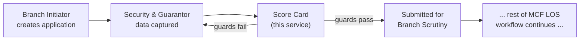
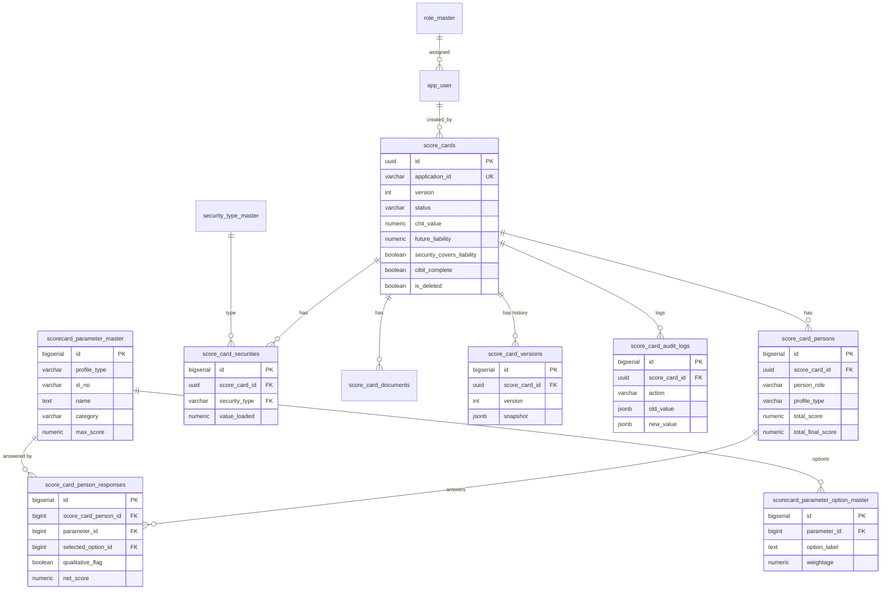
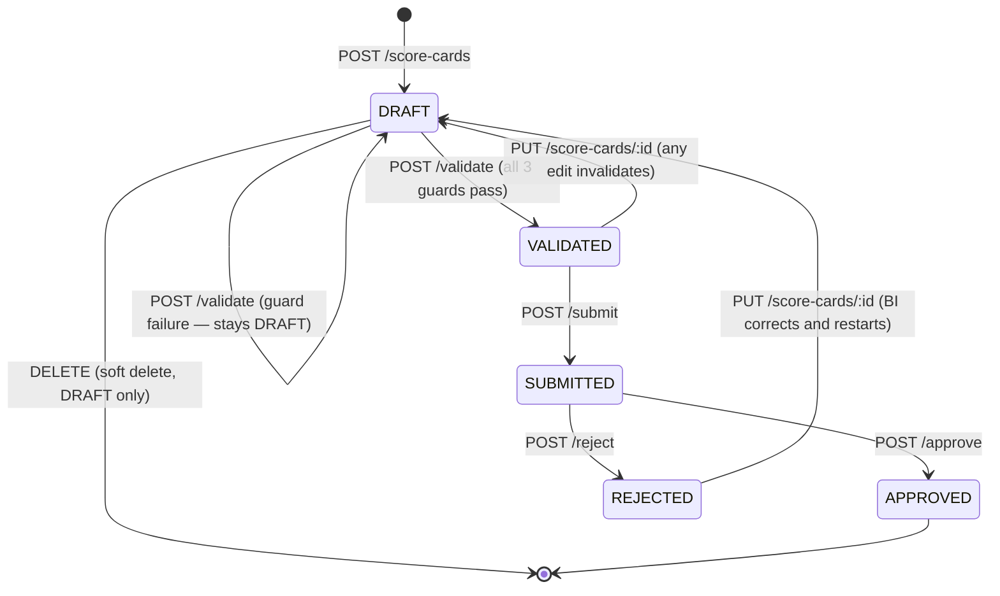
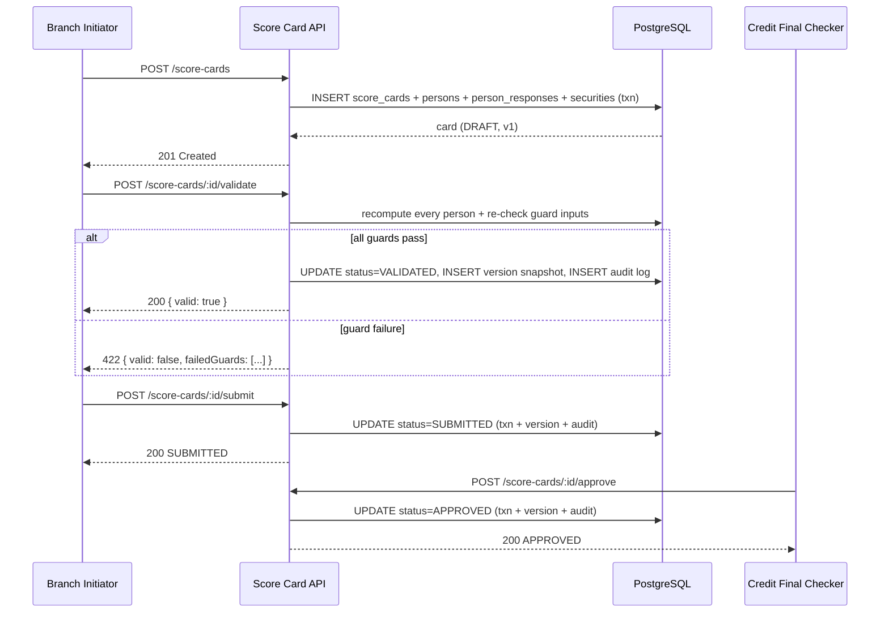

# MCF LOS — Score Card Module: Technical Documentation

## Change Log — Credit Score Excel Rebuild

This update replaces the module's entire scoring model with the one defined in
**`Credit Score.xlsx`** (two sheets: **Employee** → `SALARIED` profile, **Business** →
`BUSINESS` profile), per an explicit instruction to treat that workbook as the single
source of truth and update the existing module to match it exactly, without rebuilding
it from scratch. Everything else (auth, RBAC, workflow lifecycle, audit trail,
versioning, security valuation, document upload) is unchanged.

**What changed:**
- **Scoring model replaced.** The previous **6-factor model** (CIBIL Score,
  Income-EMI Coverage, Security Coverage/LTV, DPD History, Enquiry Count, Guarantor
  Quality — engineering-default bands, never signed off by Credit Policy) is fully
  removed. `src/modules/scorecard/scoring.engine.js` and its 45 tests are deleted.
- **New model**: two independent, dropdown-driven parameter matrices (13
  QUANTITATIVE + 7 QUALITATIVE parameters for `SALARIED`; 14 QUANTITATIVE + 7
  QUALITATIVE for `BUSINESS`), each parameter answered by selecting one option from a
  fixed list (QUANTITATIVE: `netScore = maxScore × option.weightage`) or a yes/no flag
  (QUALITATIVE: a fixed penalty). See Section 5 and Section 19.
- **Scoring moved from case-level to person-level.** The old model computed one
  blended score per case (`SB × 60% + avg(guarantors) × 40%`). The Excel defines no
  cross-person blending formula at all — each subscriber/guarantor now has their own
  independent `totalScore`/`totalFinalScore`, scored against whichever profile
  (`SALARIED`/`BUSINESS`) applies to *that person*. A case can freely mix profiles
  (e.g. a salaried subscriber with a business guarantor).
- **No eligibility threshold.** The old model's 75/60 decision thresholds
  (`eligible`, `decisionText`) are removed — the Excel computes a Total Final Score
  but defines no pass/fail cutoff on it. See Section 20, item 1.
- **Database**: `scorecard_decision_band_master` dropped. New tables
  `scorecard_parameter_master`, `scorecard_parameter_option_master` (the seeded
  Excel matrix) and `score_card_person_responses` (one row per person per answered
  parameter). `score_cards` and `score_card_persons` had their 6-factor/Annexure-era
  columns (`gross_monthly_income`, `existing_obligations`, `proposed_emi`,
  `total_score`, `eligible`, `decision_text`, `employment_type`, `entity_type`,
  `credit_score`, `worst_dpd_days`, `enquiry_count_6m`, `gross_income`,
  `net_income`) removed; `score_card_persons` gained `profile_type`, `total_score`,
  `total_final_score`. See `db/schema.sql` and `db/seed_credit_score.sql`.
- **API**: `Person` request/response shape is now `{ name, profileType, responses[] }`
  instead of `{ name, employmentType, entityType, creditScore, worstDpdDays,
  enquiryCount6Months, grossIncome, netIncome }`. `CreateScoreCardRequest` no longer
  takes `grossMonthlyIncome`/`existingObligations`/`proposedEmi` (those were 6-factor
  inputs only). New endpoint `GET /masters/credit-score-parameters?profileType=...`
  exposes the dropdown matrix; `GET /masters/score-bands`, `/employment-types`,
  `/entity-types` are removed (they described concepts — eligibility bands, a fixed
  employment-type enum — the Excel does not define). `GET /score-cards` no longer
  accepts an `eligible` filter. `ScoreSummary` returns per-person totals
  (`subscriber`/`guarantors[]`, each with `totalScore`/`totalFinalScore`) instead of
  case-level `factors`/`totalScore`/`eligible`/`decisionText`.
- **What was preserved unchanged**: JWT auth, RBAC, the DRAFT → VALIDATED →
  SUBMITTED → APPROVED/REJECTED lifecycle and its endpoints/URLs, audit logging,
  version snapshots, the security Accepted Value Formula (Section 5.6), document
  upload, and the three submit guards (`documentsComplete`, `securityCoversLiability`,
  `cibilComplete`) — only *how* `cibilComplete` is derived changed (now: every person
  has answered their profile's "CIBIL Score" parameter, rather than a non-null bureau
  `creditScore` field).

---

## 1. Executive Summary

This service implements the **Score Card module** of the MCF Prize-Money-Against-Security
Loan Origination System: the subscriber/guarantor credit-risk scoring step that runs
before a loan application is submitted for scrutiny. It is a standalone REST API +
PostgreSQL backend, independently deployable from the rest of MCF LOS.

The scoring model implemented here is **`Credit Score.xlsx`**, taken verbatim as the
single source of truth (see the Change Log above and Section 19). The workbook
defines **two independent score cards**:

1. **Employee (Salaried)** → `profileType = SALARIED` — 13 QUANTITATIVE parameters
   (max scores summing to 100) + 7 QUALITATIVE penalty flags.
2. **Business (Self Employed / Business Profile)** → `profileType = BUSINESS` — 14
   QUANTITATIVE parameters (also summing to 100) + the same 7 QUALITATIVE flags.

Every QUANTITATIVE parameter is answered by picking exactly one option from a fixed
dropdown list (its net score = the parameter's max score × the selected option's
weightage, sourced from the Excel's own `VLOOKUP`). Every QUALITATIVE parameter is a
yes/no flag carrying a fixed (negative) penalty if flagged. **Scoring is per-person**:
the subscriber and each guarantor are scored independently, against whichever
profile applies to them — the workbook has no formula that blends scores across
people.

The security valuation formula (Section 5.6) is unrelated to the Credit Score
matrix and unchanged — it is grounded in the earlier, signed-off FRD (Functional
Requirements Document) Section 6.1, Table 20, and remains authoritative.

**What this service does:**
- Loads the correct Credit Score parameter matrix for each person (via
  `GET /masters/credit-score-parameters?profileType=...`) and accepts their answers
  as `responses[]`.
- Computes each person's `totalScore` (sum of QUANTITATIVE net scores) and
  `totalFinalScore` (`totalScore` + sum of QUALITATIVE penalties) — instantly, on
  every answer change, with zero hardcoded scoring values (all come from the DB,
  seeded from the Excel).
- Enforces the three guard conditions that gate submission (documents complete,
  security covers future liability, CIBIL Score parameter answered for every person).
- Runs the full Draft → Validate → Submit → Approve/Reject lifecycle with a complete,
  immutable audit trail and version history.

**What this service deliberately does not do:** originate the loan application itself,
manage chit/auction data, handle disbursement, define an eligibility/pass-fail
threshold on the Total Final Score (the Excel does not define one — see Section 20),
or replace the full 10-section CAM used elsewhere in MCF LOS.

---

## 2. Functional Overview

### 2.1 Where the Score Card sits in the loan journey



### 2.2 Mandatory vs. optional fields

| Field | M/O | Notes |
|---|---|---|
| `applicationId` | Mandatory | Must match `MCF-YYYY-NNNNNN`; one score card per application |
| `chitValue` | Mandatory | Proposed loan/prize amount; not an input to the Credit Score matrix |
| `futureLiability` | Mandatory | Drives the `securityCoversLiability` guard |
| `documentsComplete` | Mandatory (boolean, defaults false) | Drives one of the three submit guards |
| `subscriber` | Mandatory | `{ name, profileType, responses[] }` — see Section 5 |
| `subscriber.profileType` | Mandatory | `SALARIED` or `BUSINESS` — selects which Credit Score matrix this person is scored against |
| `subscriber.responses[]` | Optional at create (may be partial — draft state); every QUANTITATIVE parameter answered is **mandatory before Validate can pass** | Each entry is `{parameterId, selectedOptionId}` (QUANTITATIVE) or `{parameterId, qualitativeFlag}` (QUALITATIVE) |
| `guarantors` | Optional (0–4) | Each independently profiled/scored; a case may mix `SALARIED` and `BUSINESS` guarantors |
| `securities` | Mandatory (min. 1) | Drives `securityTotalValue`, which feeds the `securityCoversLiability` guard (unrelated to the Credit Score matrix) |

### 2.3 Section dependencies

- **A person's `responses[]` are only valid against their own `profileType`'s
  parameter matrix** — a `parameterId` seeded under `BUSINESS` is rejected
  (`ApiError.validation`) if referenced by a `SALARIED` person's response, and vice
  versa (`src/modules/scorecard/creditScoreEngine.js`).
- **Security Coverage depends on Securities** — the accepted security value must be
  computed (Section 5.6) before the `securityCoversLiability` guard can evaluate, so
  `securities` is required at creation, not deferred to a later step.
- **Submit depends on Validate** — `POST /submit` will reject with
  `INVALID_STATE_FOR_SUBMIT` unless the card is already `VALIDATED`; validation is not
  an implicit side-effect of submit, by design, so a UI can show the client exactly
  which guard failed before they attempt to submit.
- **Approve/Reject depend on Submit** — only a `SUBMITTED` (or `UNDER_REVIEW`) card can
  be approved or rejected.

---

## 3. Architecture

```
scorecardapi/
├── db/
│   ├── schema.sql               # full DDL — tables, constraints, indexes, triggers
│   ├── seed.sql                  # master data + demo users (mirrors live MCF LOS config)
│   └── seed_credit_score.sql      # GENERATED from Credit Score.xlsx — the parameter/option matrix
├── src/
│   ├── app.js               # Express app assembly (security middleware, routes, /docs)
│   ├── server.js            # process entrypoint, graceful shutdown
│   ├── config/               # env.js, db.js (pg Pool + withTransaction helper)
│   ├── middleware/            # auth (JWT), rbac, validate (Joi), sanitize, errorHandler
│   ├── modules/
│   │   ├── auth/                          # login/refresh
│   │   ├── scorecard/                      # the module itself: routes/controller/service/repository
│   │   │   ├── creditScoreEngine.js         # <- pure calculation engine (zero DB/HTTP deps)
│   │   │   └── parameterDefs.repository.js   # loads the parameter+option matrix for a profileType
│   │   └── masters/                        # dropdown reference data, incl. credit-score-parameters
│   └── utils/                    # ApiError, apiResponse envelope, pagination
├── tests/                          # automated tests (see Section 14)
├── openapi.yaml                     # full OpenAPI 3.0 spec, served at GET /docs
└── DOCUMENTATION.md                  # this file
```

**Layering (routes → controller → service → repository → DB):** `creditScoreEngine.js`
is the only place the scoring math lives, with zero dependency on Express or `pg` and
**zero hardcoded scoring values** — every max score, option label and weightage is
loaded from the database (seeded verbatim from `Credit Score.xlsx`) and passed in by
the caller. It is unit-testable in complete isolation (see `tests/creditScoreEngine.test.js`)
and could be lifted into a batch/offline recompute job unchanged.

---

## 4. Database Design

### 4.1 Entity-Relationship Diagram



Full DDL: [`db/schema.sql`](db/schema.sql); seeded parameter/option data:
[`db/seed_credit_score.sql`](db/seed_credit_score.sql) (generated from
`Credit Score.xlsx` — see Section 19). Highlights:
- **No duplicate mappings, enforced at the DB level**: `UNIQUE (profile_type, sl_no)`
  on `scorecard_parameter_master`, `UNIQUE (parameter_id, option_label)` on
  `scorecard_parameter_option_master`, `UNIQUE (score_card_person_id, parameter_id)`
  on `score_card_person_responses` — a person cannot have two answers for the same
  parameter.
- **Soft delete** on `score_cards` and `score_card_documents` (`is_deleted`,
  `deleted_at`, `deleted_by`) — nothing is ever hard-deleted through the API.
- **Versioning**: `score_card_versions` stores an immutable JSONB snapshot on every
  create/update/validate/submit/approve/reject/recalculate; `score_cards.version` is
  the pointer to the latest.
- **Exactly one current card per application**: enforced by
  `uq_score_cards_current_application`, a partial unique index on
  `(application_id) WHERE is_deleted = FALSE`.
- **Audit fields**: `created_by/at`, `updated_by/at`, `validated_by/at`,
  `submitted_by/at`, `reviewed_by/at`, `approved_by/at`, `rejected_by/at` are all
  first-class columns, not inferred from the audit log.

---

## 5. Business Rules

### 5.1 Two independent Credit Score Cards

`Credit Score.xlsx` defines two separate sheets, each an independent parameter
matrix — no parameter from one appears in the other:

| Profile | `profileType` | QUANTITATIVE parameters | Max-score sum | QUALITATIVE parameters |
|---|---|---|---|---|
| Employee (Salaried) | `SALARIED` | 13 | 100 | 7 (shared wording/penalties with BUSINESS) |
| Business (Self Employed / Business Profile) | `BUSINESS` | 14 | 100 | 7 |

Every person (subscriber or guarantor) on a score card carries their own
`profileType` and is scored **only** against that profile's matrix
(`GET /masters/credit-score-parameters?profileType=...`). A case may freely mix
profiles across its people (e.g. a `SALARIED` subscriber with a `BUSINESS`
guarantor) — this is a structural feature of the model, not a special case.

### 5.2 QUANTITATIVE parameters — dropdown/lookup scoring

Each QUANTITATIVE parameter (e.g. "Age", "Occupation", "CIBIL Score", "Monthly Chit
Subscription to Net Income") is answered by selecting **exactly one** option from a
fixed list. The Excel's own dropdown validation on each "selector" cell is the
authoritative option list — reproduced verbatim in
`scorecard_parameter_option_master`.

```
netScore = parameter.maxScore × selectedOption.weightage
```

`weightage` is a 0–1 ratio taken directly from the Excel's weightage column (the
value its own `VLOOKUP` formula resolves to). There are no hardcoded scoring values
anywhere in `creditScoreEngine.js` — every max score, option label and weightage is
loaded from the database.

An unanswered QUANTITATIVE parameter contributes `0` and is not "wrong" — it simply
represents a still-in-progress draft; `isFullyAnswered()` is what the Validate guard
uses to require every parameter be answered before submission.

`Total Score` (a person's `totalScore`) = the sum of all their QUANTITATIVE net
scores. Since each profile's max scores sum to exactly 100, a fully-answered
person's `totalScore` is out of 100.

### 5.3 QUALITATIVE parameters — yes/no penalty flags

The same 7 QUALITATIVE parameters apply to both profiles (identical fixed
penalties; one label's wording differs slightly per profile — see Section 19):
Politically influenced (−100), Constitutional position (−100), Police Department
(−100), Lawyer/advocate (−50), Trouble shooter/Litigant (−80), Critical illness
(−50), Recently hospitalized (−50).

```
netScore = flagged ? parameter.maxScore : 0     // maxScore is already negative
```

Unlike QUANTITATIVE parameters, QUALITATIVE flags always default to un-flagged
(`false`) rather than "unanswered" — the Excel's example rows show all seven at 0.

`Total Final Score` (a person's `totalFinalScore`) = `totalScore` + the sum of all
their QUALITATIVE net scores (penalties).

### 5.4 Submit guards (mandatory conditions)

A score card can only move `DRAFT → VALIDATED` (and therefore only be submitted) when
**all three** of the following hold — these mirror the exact guard array MCF LOS's
`workflow-engine.js` enforces at the `BRANCH_WIP → SCRUTINY_PENDING` transition:

1. `documentsComplete = true`
2. `securityTotalValue >= futureLiability` (`securityCoversLiability`) — unrelated to
   the Credit Score matrix; see Section 5.6.
3. Every person (subscriber + all guarantors) has answered their profile's "CIBIL
   Score" parameter (`cibilComplete`) — i.e. has a `selectedOptionId` for it, not
   necessarily any particular band.

### 5.5 Role-wise restrictions

See [Section 8 — RBAC Matrix](#8-security). In summary: **BI** creates/edits/submits
its own drafts; **FC, RA, CH, FA, BA** (holders of `caseApprove`/`caseReject`) approve
or reject a submitted card; only **ADMIN** currently holds `auditView`.

### 5.6 Security Accepted Value Formula (FRD Section 6.1, Table 20)

Unrelated to the Credit Score matrix and unchanged by this update. `valueLoaded` —
the amount of a security's value actually counted toward covering the Future
Liability — is **always computed server-side**
(`src/modules/scorecard/securityValuation.js`) from type-specific raw inputs. It is
**never** accepted as a raw number from the client.

| Security Type | Required Input(s) | Accepted Value Formula |
|---|---|---|
| Gold Ornaments | `netWeightGrams`, `ratePerGram` | `netWeightGrams × ratePerGram` (no haircut) |
| LIC Policy | `surrenderValue` | 100% of Surrender Value |
| Bank Guarantee | `faceValue` | 100% of Face Value |
| Fixed Deposit | `faceValue` | 100% of Face Value |
| Demat NCD | `faceValue` | 100% of Face Value |
| Sub-Debt (Deposit with Group Co.) | `apiSourcedValue`, `maturityDate` | "As per API" — accepted as given, not computed |
| Chit Passbook (Pledge) | `apiSourcedValue` | "As per API" — accepted as given, not computed |
| Mortgage (Property) | `forcedSaleValue` | `(forcedSaleValue ÷ 150) × 100` |
| Demat Shares | `marketValue`, `liabilityToSecure` | `liabilityToSecure < ₹2L` → `50% × marketValue`; else `min(50% × marketValue, 40% × liabilityToSecure)` |
| Personal Surety | — | 0 (no tangible security value) |

> `security_type_master.ltv_cap` is retained for informational/dropdown display
> only — it is **not** used by `computeAcceptedValue()`.

---

## 6. Calculation Engine Reference

Implemented in [`src/modules/scorecard/creditScoreEngine.js`](src/modules/scorecard/creditScoreEngine.js),
covered by `tests/creditScoreEngine.test.js`. Calculation sequence for **one person**:

1. `parameterDefs` for that person's `profileType` are loaded (`parameterDefs.repository.js`)
   — the ordered list of parameters, each with its options (QUANTITATIVE) or fixed
   penalty (QUALITATIVE).
2. For each QUANTITATIVE parameter: if the person answered it (`selectedOptionId`
   present), look up that option among the parameter's own options — an option
   belonging to a *different* parameter is rejected with `ApiError.validation` — and
   compute `maxScore × option.weightage`. If unanswered, `netScore = 0`,
   `answered = false`.
3. For each QUALITATIVE parameter: `netScore = flagged ? maxScore : 0`.
4. `totalScore` = sum of all QUANTITATIVE net scores (rounded to 2 decimals).
5. `totalPenalty` = sum of all QUALITATIVE net scores (rounded to 2 decimals).
6. `totalFinalScore` = `totalScore + totalPenalty`.
7. `isFullyAnswered()` — true once every QUANTITATIVE parameter has a
   `selectedOptionId` — used to require a complete Credit Score sheet before Validate.
8. `hasCibilResponse()` — true once the parameter whose name matches `/cibil/i` has
   a `selectedOptionId` — this is what `cibilComplete` (Section 5.4) is built from,
   evaluated once per person and ANDed across the whole card.
9. Security guards (`securityTotalValue`, `securityCoversLiability`,
   `documentsComplete`) are computed independently of the above, from `securities`/
   `futureLiability`/`documentsComplete` (Section 5.6) — the Excel has no formula
   relating them to the Credit Score matrix.

---

## 7. Workflow — Full Lifecycle



> **`UNDER_REVIEW` is reserved, not yet reachable in v1.** The status enum and the
> Approve/Reject guards already accept it (`SUBMITTED` or `UNDER_REVIEW`), anticipating
> a future "Start Review" action. No v1 endpoint transitions a card into
> `UNDER_REVIEW` — flagged explicitly in [Section 20](#20-open-questions).

### 7.1 Sequence diagram — happy path



---

## 8. Security

- **Authentication**: JWT (HS256) via `POST /auth/login`; access token TTL 15m,
  refresh token TTL 7d (both configurable). Every route except `/auth/*` and `/health`
  requires `Authorization: Bearer <token>`.
- **RBAC**: `src/middleware/rbac.js` mirrors the live MCF LOS
  `assets/json/roles-permissions.json` matrix exactly:

  | Role | Relevant Score Card permissions |
  |---|---|
  | BI | caseCreate, caseEdit, caseSubmit, caseViewOwn, docUpload |
  | FC | caseViewAll, camView, camGenerate, camEdit, caseApprove, caseReject, caseReturn |
  | RA | caseViewAll, camView, camEdit, caseApprove, caseReject, caseHold |
  | CH | caseViewAll, camView, camEdit, caseApprove, caseReject |
  | DEV | caseViewAll, camView, deviationApprove, deviationReject |
  | FA / BA | caseViewAll, camView, caseApprove, caseReject |
  | ADMIN | wildcard — every permission, incl. `auditView` |

- **Row-level ownership**: a role holding only `caseViewOwn` (BI, FI) may act on a
  score card only if `created_by` matches their user id; roles holding `caseViewAll`
  may act on any record. A request for a **non-existent** record always yields 404,
  never 403.
- **Input sanitization**: `src/middleware/sanitize.js` strips `<script>` tags and null
  bytes from every string in `body`/`query`/`params`, as defence-in-depth.
- **SQL injection prevention**: every query in `scorecard.repository.js` (and
  `parameterDefs.repository.js`) uses parameterised placeholders (`$1, $2, ...`) —
  no string concatenation of untrusted input into SQL, anywhere.
- **XSS protection**: `helmet()` sets standard security headers; all API responses are
  `application/json` (never reflected HTML).
- **Audit logging**: every mutating action writes exactly one row to
  `score_card_audit_logs` with actor, role, IP, user-agent, old/new value JSON, and
  timestamp — see Section 13.
- **Encryption for sensitive data**: passwords are bcrypt-hashed (never stored
  plaintext); TLS termination is expected at the load balancer/ingress.

---

## 9. Error Handling

Every error response uses the same envelope (`src/middleware/errorHandler.js`):

```json
{
  "success": false,
  "error": {
    "code": "VALIDATION_ERROR",
    "message": "One or more fields failed validation",
    "details": [{ "field": "applicationId", "message": "..." }],
    "requestId": "b3f1..."
  }
}
```

| Scenario | HTTP | `code` |
|---|---|---|
| Field fails Joi validation | 422 | `VALIDATION_ERROR` |
| `selectedOptionId` does not belong to the given `parameterId` | 422 | `VALIDATION_ERROR` |
| Business/workflow rule violated (wrong status for this action) | 422 | e.g. `INVALID_STATE_FOR_SUBMIT` |
| Missing/invalid/expired JWT | 401 | `UNAUTHORIZED` |
| Authenticated but lacks permission | 403 | `FORBIDDEN` |
| Record does not exist | 404 | `NOT_FOUND` |
| Duplicate `applicationId` | 409 | `DUPLICATE_SCORE_CARD` |
| Postgres unique-violation (23505) not otherwise handled | 409 | `DUPLICATE_RECORD` |
| Postgres FK-violation (23503) | 409 | `FOREIGN_KEY_VIOLATION` |
| Unhandled exception | 500 | `INTERNAL_SERVER_ERROR` |

---

## 10. Performance

- **Pagination**: every list endpoint (`GET /score-cards`, `/history`, `/audit-logs`)
  is paginated (`page`, `pageSize`, max 100) with a `meta` block (`totalRecords`,
  `totalPages`).
- **Filtering & sorting**: `GET /score-cards` supports `status`, `applicationId`,
  `createdBy`, `fromDate`/`toDate`, and a whitelisted `sort` field (rejecting
  arbitrary column names prevents SQL-injection-via-ORDER-BY). There is no `eligible`
  filter — the model has no eligibility concept (Section 20).
- **Indexes**: partial unique index on `score_cards(application_id) WHERE NOT
  is_deleted`; indexes on `status`, `created_by`; every child table indexed on its
  `score_card_id`/`score_card_person_id` FK; `scorecard_parameter_master` indexed on
  `(profile_type, display_order)`; audit logs indexed on `(score_card_id, created_at DESC)`.
- **Transactions**: every multi-statement mutation (create, update, status
  transitions) runs inside `withTransaction()` — a single connection, `BEGIN`, and
  automatic `ROLLBACK` on any thrown error (see `config/db.js`).
- **Caching**: not implemented in v1 — the parameter/option matrix is small (41 rows +
  161 options total) and rarely changes; flagged as an open enhancement in Section 20
  if the masters endpoints need response caching under load.
- **Connection pooling**: `pg.Pool` with `max: 20`, 30s idle timeout, 5s connect
  timeout.

---

## 11. Integration Points

| System | Direction | Purpose | Status |
|---|---|---|---|
| Main MCF LOS application | Inbound | Creates/reads score cards keyed by `applicationId` | Primary caller |
| Credit Bureau (CIBIL/Equifax/CRIF) | External, informs the caller | The "CIBIL Score" parameter is a band dropdown (e.g. "750 and above", "700 to 749", ...) the caller selects based on a bureau report pull done upstream — this service does not call the bureau itself | Out of scope for this service |
| Document Management / Object Storage | External, upstream | `POST /documents` stores only a `fileUrl` reference — actual file bytes are uploaded directly to storage by the caller | Out of scope for this service |
| Rule Engine | N/A | The scoring rules are implemented directly in `creditScoreEngine.js` against DB-seeded parameter definitions, not delegated to an external rules engine, for auditability and unit-testability | By design |
| Workflow/Case API (main LOS) | Bidirectional | The main LOS's `WorkflowEngine.transition('submitForScrutiny', ...)` should be called by the orchestrating layer once this service's `/submit` succeeds | Integration contract — see Section 20 |

---

## 12. Supporting Documents Upload Flow

`POST /score-cards/:id/documents` accepts a **reference** (`fileUrl`) rather than raw
file bytes. The expected flow: caller requests a pre-signed upload URL from its
document storage provider, uploads the file directly to storage, then calls this
endpoint with the resulting URL to attach it to the score card.

---

## 13. Audit Trail

Every mutating action (`CREATE`, `UPDATE`, `SAVE_DRAFT`, `VALIDATE`, `SUBMIT`,
`APPROVE`, `REJECT`, `RECALCULATE`, `DELETE`, `DOC_UPLOAD`) writes exactly one row to
`score_card_audit_logs`:

| Column | Captures |
|---|---|
| `actor_user_id`, `actor_role`, `actor_label` | Who |
| `action` | What |
| `old_value` / `new_value` (JSONB) | Before/after, where meaningful |
| `ip_address`, `user_agent` | Where from |
| `created_at` | When |
| `detail` | Free-text remark (e.g. rejection reason, which guards failed) |

Additionally, `score_card_versions` keeps a **full JSONB snapshot** of the score card
at every one of those points — the audit log tells you *that* something changed, the
version history tells you *exactly what it looked like* at that point in time.

---

## 14. Test Cases

98 automated tests, all passing against a real PostgreSQL instance (not mocked):

| File | Covers |
|---|---|
| `tests/creditScoreEngine.test.js` | The Excel-verified reference example (SALARIED total = 76.5); lowest/highest/fractional weightage boundaries for both profiles; unanswered-parameter draft state; QUALITATIVE flag on/off; rejecting an option that belongs to a different parameter; `isFullyAnswered`/`hasCibilResponse` guards |
| `tests/securityValuation.test.js` | Every security type's Accepted Value Formula (Section 5.6 / FRD Table 20), incl. the Demat Shares ₹2L boundary and missing-required-field errors |
| `tests/scorecard.validation.test.js` | Joi schema positive/negative/boundary cases for the `{name, profileType, responses[]}` Person shape (duplicate parameterId rejection, xor of selectedOptionId/qualitativeFlag), incl. SQL-injection-shaped and oversized inputs |
| `tests/scorecard.api.test.js` | Full HTTP lifecycle: auth, RBAC (positive + negative per role), both profiles (incl. a mixed-profile case), guard failures (incl. CIBIL-unanswered), status-transition rule violations, draft/partial answers, recalculation, pagination/filtering/sorting, soft delete, audit/history/summary endpoints, the `credit-score-parameters` masters endpoint |

Run locally:
```bash
npm install
createdb mcf_scorecard_test   # or: psql -c "CREATE DATABASE mcf_scorecard_test;"
# point .env at that DB (see .env.example), then:
npm run db:migrate
npm run db:seed
npm test
```

---

## 15. Developer Notes

- **Never** hand-edit a scoring value in the database or in code** — every max score,
  option label and weightage must come from re-running the extraction against
  `Credit Score.xlsx` and regenerating `db/seed_credit_score.sql`; that file's header
  comment says the same. `creditScoreEngine.js` itself has zero hardcoded scoring
  constants by design, precisely so this can never silently drift from the workbook.
- The `id` path param is always the internal UUID (`score_cards.id`), never the
  external `applicationId` — use `GET /score-cards/application/:applicationId` when
  you only have the latter.
- `PUT` vs `PATCH /draft`: `PUT` recomputes scores and can flip `VALIDATED → DRAFT`;
  `PATCH /draft` is a pure persistence operation with **no** guard/status side-effects,
  for the "still typing" autosave case — a person's `responses[]` may be a partial
  subset of their profile's parameters in a draft.
- `POST /validate` returns **HTTP 200 with `data.valid: true`** on success, and
  **HTTP 422 with `data.valid: false`** on guard failure — 422 here is not a generic
  server-side validation error, it's a legitimate, expected business outcome; check
  `data.valid`, not just the status code, when calling this endpoint programmatically.

---

## 16. Deployment Considerations

- **Environments**: at minimum Dev / UAT / Production, each with its own `.env`
  (see `.env.example`) and its own PostgreSQL database — never share a database
  across environments.
- **Secrets**: `JWT_SECRET` and `DB_PASSWORD` must be injected via the deployment
  platform's secret store (not committed) in any non-local environment; `.env` is
  git-ignored.
- **TLS**: this app does not terminate TLS itself — deploy behind a load balancer,
  API gateway, or reverse proxy that does.
- **Migrations**: `db/schema.sql`, `db/seed.sql` **and `db/seed_credit_score.sql`**
  are plain SQL, run once per environment (`npm run db:migrate` / `npm run db:seed`
  — the latter now runs all three files, see `package.json`). For ongoing schema
  evolution beyond this initial version, adopt a migration tool (e.g. `node-pg-migrate`
  or `Flyway`) rather than hand-editing `schema.sql` in place.
- **Health check**: `GET /health` (no auth) for load-balancer/container-orchestrator
  liveness probes.
- **API docs**: `GET /docs` serves the Swagger UI from `openapi.yaml`.
- **Graceful shutdown**: `SIGINT`/`SIGTERM` close the HTTP server and drain the PG
  pool before exiting (see `src/server.js`).

---

## 17. Consolidated Endpoint Reference

| # | API | Method | Path |
|---|---|---|---|
| 1 | Create Score Card | POST | `/score-cards` |
| 2 | Get Score Card | GET | `/score-cards/:id` |
| 3 | Get Score Card by Application ID | GET | `/score-cards/application/:applicationId` |
| 4 | Update Score Card | PUT | `/score-cards/:id` |
| 5 | Save Draft | PATCH | `/score-cards/:id/draft` |
| 6 | Validate Score Card | POST | `/score-cards/:id/validate` |
| 7 | Submit Score Card | POST | `/score-cards/:id/submit` |
| 8 | Approve Score Card | POST | `/score-cards/:id/approve` |
| 9 | Reject Score Card | POST | `/score-cards/:id/reject` |
| 10 | Recalculate Score | POST | `/score-cards/:id/recalculate` |
| 11 | Delete Score Card | DELETE | `/score-cards/:id` |
| 12 | Get Score Summary | GET | `/score-cards/:id/summary` |
| 13 | Get Score History | GET | `/score-cards/:id/history` |
| 14 | Get Audit Logs | GET | `/score-cards/:id/audit-logs` |
| 15 | Get Dropdown Masters | GET | `/masters/security-types`, `/credit-score-parameters`, `/document-types`, `/roles` |
| 16 | Upload Supporting Documents | POST | `/score-cards/:id/documents` |
| — | List (pagination/filter/sort) | GET | `/score-cards` |
| — | Login / Refresh | POST | `/auth/login`, `/auth/refresh` |

Full request/response schemas, examples, and error codes for every one of the above:
[`openapi.yaml`](openapi.yaml) (served interactively at `GET /docs`).

---

## 18. Compliance Note: What This Document Assumes vs. Confirms

The Credit Score matrix (Sections 5.1–5.3, 19) is taken **verbatim** from
`Credit Score.xlsx`, provided as the explicit single source of truth — every
parameter, option, weightage and max score is a direct transcription (see Section 19
and the extraction verification described there), not an engineering estimate. The
security valuation formula (Section 5.6) remains grounded in the earlier, signed-off
FRD. Anything not settled by either document is called out in Section 20.

---

## 19. Excel-to-Application Mapping

`Credit Score.xlsx` → `db/seed_credit_score.sql` → `scorecard_parameter_master` /
`scorecard_parameter_option_master` → `GET /masters/credit-score-parameters` →
`Person.responses[]` → `score_card_person_responses` → `Person.totalScore`/`totalFinalScore`.

Every parameter below was verified during extraction by reproducing the Excel's own
cached `VLOOKUP` result for its example-selected option (100% match, all 27
parameters) before being transcribed into `db/seed_credit_score.sql`; full option-level
detail (all 161 options with their exact weightages) lives in that file, generated
programmatically from the verified extraction rather than hand-typed.

### 19.1 SALARIED (Employee sheet) — 13 QUANTITATIVE + 7 QUALITATIVE, max scores sum to 100

| Sl No | Excel Parameter | Category | Max Score | Options | DB row | API field |
|---|---|---|---|---|---|---|
| 1 | Age of Subscriber/Guarantor | QUANTITATIVE | 5 | 7 | `scorecard_parameter_master (profile_type='SALARIED', sl_no='1')` | `responses[].parameterId` → this row's `id` |
| 2 | Occupation | QUANTITATIVE | 8 | 14 | sl_no='2' | " |
| 3 | No. of Years of Confirmed/Regular Service | QUANTITATIVE | 5 | 7 | sl_no='3' | " |
| 4 | Annual Income as per ITR/Form No.16 | QUANTITATIVE | 5 | 8 | sl_no='4' | " |
| 5 | Monthly Chit Subscription to Net Income | QUANTITATIVE | 20 (highest weight) | 6 | sl_no='5' | " |
| 6 | Other Income to Total Assessed/Approved Income | QUANTITATIVE | 5 | 5 | sl_no='6' | " |
| 7 | Market Value of Self-Owned Property to Future Liability | QUANTITATIVE | 10 | 7 | sl_no='7' | " |
| 8 | CIBIL Score | QUANTITATIVE | 13 | 6 | sl_no='8' | drives `cibilComplete` (Section 5.4) |
| 9 | Unexpired Chit Period | QUANTITATIVE | 8 | 4 | sl_no='9' | " |
| 10 | Track Record of Subscription Payment | QUANTITATIVE | 8 | 6 | sl_no='10' | " |
| 11 | Cheque Returns | QUANTITATIVE | 5 | 7 | sl_no='11' | " |
| 12 | Mode of Payment of Subscription | QUANTITATIVE | 3 | 4 | sl_no='12' | " |
| 13 | Follow-up Effort for Collection | QUANTITATIVE | 5 | 2 | sl_no='13' | " |
| a | Politically influenced | QUALITATIVE | −100 | flag | sl_no='a' | `responses[].qualitativeFlag` |
| b | Constitutional position | QUALITATIVE | −100 | flag | sl_no='b' | " |
| c | Police Department | QUALITATIVE | −100 | flag | sl_no='c' | " |
| d | Lawyer/advocate | QUALITATIVE | −50 | flag | sl_no='d' | " |
| e | Trouble shooter/Litigant | QUALITATIVE | −80 | flag | sl_no='e' | " |
| f | Critical illness | QUALITATIVE | −50 | flag | sl_no='f' | " |
| g | Recently hospitalized/not attending to office | QUALITATIVE | −50 | flag | sl_no='g' | " |

### 19.2 BUSINESS (Business sheet) — 14 QUANTITATIVE + 7 QUALITATIVE, max scores sum to 100

Differs from SALARIED in several bands (Age max 3 not 5, different age-band
boundaries; Occupation max 3 with only 5 options not 14) and adds one parameter with
no SALARIED counterpart at all ("Sales growth in past 3 years").

| Sl No | Excel Parameter | Category | Max Score | Options | DB row | API field |
|---|---|---|---|---|---|---|
| 1 | Age of Subscriber/Guarantor | QUANTITATIVE | 3 | 7 | `scorecard_parameter_master (profile_type='BUSINESS', sl_no='1')` | `responses[].parameterId` → this row's `id` |
| 2 | Occupation | QUANTITATIVE | 3 | 5 | sl_no='2' | " |
| 3 | No. of Years in Business | QUANTITATIVE | 5 | 7 | sl_no='3' | " |
| 4 | Sales growth in past 3 years (BUSINESS-only) | QUANTITATIVE | 5 | 4 | sl_no='4' | " |
| 5 | Annual Income as per ITR | QUANTITATIVE | 5 | 8 | sl_no='5' | " |
| 6 | Monthly Chit Subscription to Net Income | QUANTITATIVE | 22 (highest weight) | 6 | sl_no='6' | " |
| 7 | Other Income to Total Assessed/Approved Income | QUANTITATIVE | 5 | 5 | sl_no='7' | " |
| 8 | Market Value of Self-Owned Property to Future Liability | QUANTITATIVE | 10 | 7 | sl_no='8' | " |
| 9 | CIBIL Score | QUANTITATIVE | 13 | 6 | sl_no='9' | drives `cibilComplete` (Section 5.4) |
| 10 | Unexpired Chit Period | QUANTITATIVE | 8 | 4 | sl_no='10' | " |
| 11 | Track Record of Subscription Payment | QUANTITATIVE | 8 | 6 | sl_no='11' | " |
| 12 | Cheque Returns | QUANTITATIVE | 5 | 7 | sl_no='12' | " |
| 13 | Mode of Payment of Subscription (Cash weightage 0.9, vs 0.7 for SALARIED) | QUANTITATIVE | 3 | 4 | sl_no='13' | " |
| 14 | Follow-up Effort for Collection | QUANTITATIVE | 5 | 2 | sl_no='14' | " |
| a–g | Same 7 QUALITATIVE flags as SALARIED (item 'g' wording: "...not attending to office **or business**") | QUALITATIVE | −100/−100/−100/−50/−80/−50/−50 | flag | sl_no='a'..'g' | `responses[].qualitativeFlag` |

### 19.3 Verification method

Extraction was done via two `openpyxl` passes (`data_only=False` for formulas,
`data_only=True` for the Excel's own cached values), reading Data Validation
dropdown-list ranges (`ws.data_validations.dataValidation`) as the authoritative
option source per parameter, and cross-checking every one of the 27 parameters'
example-selected option against the workbook's own cached `VLOOKUP` result — 100%
match, zero discrepancies, before any SQL was generated.

---

## 20. Open Questions

| # | Item | Type | Detail |
|---|---|---|---|
| 1 | No eligibility/pass-fail threshold | **Needs Credit Policy decision** | `Credit Score.xlsx` computes a Total Final Score per person but defines **no** cutoff, band, or decision text on it anywhere in either sheet. This service therefore returns the computed totals only (`Person.totalScore`/`totalFinalScore`) and makes no eligible/not-eligible determination. If one is wanted, it needs to be specified (e.g. a threshold on the subscriber's score, or some combination across subscriber+guarantors) — the Excel gives no guidance on combining multiple people's scores into one case-level decision either. |
| 2 | `UNDER_REVIEW` status | Assumption | Modelled in the schema and guards for forward-compatibility; no v1 endpoint transitions a card into it. |
| 3 | `auditView` is ADMIN-only | Confirmed-as-is | Mirrors the live `roles-permissions.json` exactly. |
| 4 | Score card ↔ main LOS case linkage | Assumption | This service tracks `applicationId` as a plain string key; it does not call back into the main LOS's `WorkflowEngine` itself. |
| 5 | Schema migrations beyond v1 | Assumption | `db/schema.sql` + `db/seed_credit_score.sql` are a single baseline; adopt a migration tool before the first post-launch schema change. |
| 6 | Document upload is reference-only | Confirmed-as-is | This API never receives raw file bytes — see Section 12. |
| 7 | CIBIL Score is a band dropdown, not a raw bureau number | Confirmed-as-is (Excel-defined) | The Excel models "CIBIL Score" as a 6-option band dropdown ("750 and above" ... "Less than 600" ... "Not rated"), not a raw 300–900 number — the caller selects the band based on the bureau report, rather than this service computing a linear score from a raw value as the old 6-factor model did. |
| 8 | `security_type_master.ltv_cap` | Confirmed-as-is | Informational/dropdown display only, unrelated to the Credit Score matrix or the Accepted Value Formula — unchanged by this update. |
